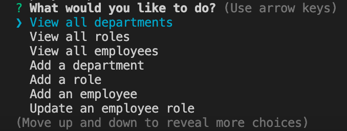

# SQL Employee Tracker

## Description

The purpose of this project was to create a command-line application that allows the user to manage a company's employee database, using Node.js, Inquirer, and MySQL. The user is able to view and manage the departments, roles, and employees in the company, and is able to add departments, roles, and employees, as well as update employee roles.

## Usage

Users can use this application by installing the required dependencies and running the application from the command line. The user will be presented with a series of prompts that will allow them to view, add, and update the company's employee database.

### Video Link

https://drive.google.com/file/d/1r6orjRHl3M2ocfJyguiMnR3R1e52WPVf/view

### Webpage Screenshot

## Credits

This challenge was completed in collaboration with the instructional staff (Diarmuid Murphy), TA/tutor (Meg Meyers) and classmates in the February 2023 UCLA Extension Coding Boot Camp.

## License

MIT License

Copyright (c) 2023 Brian Autieri

Permission is hereby granted, free of charge, to any person obtaining a copy of this software and associated documentation files (the "Software"), to deal in the Software without restriction, including without limitation the rights to use, copy, modify, merge, publish, distribute, sublicense, and/or sell copies of the Software, and to permit persons to whom the Software is furnished to do so, subject to the following conditions:

The above copyright notice and this permission notice shall be included in all copies or substantial portions of the Software.

THE SOFTWARE IS PROVIDED "AS IS", WITHOUT WARRANTY OF ANY KIND, EXPRESS OR IMPLIED, INCLUDING BUT NOT LIMITED TO THE WARRANTIES OF MERCHANTABILITY, FITNESS FOR A PARTICULAR PURPOSE AND NONINFRINGEMENT. IN NO EVENT SHALL THE AUTHORS OR COPYRIGHT HOLDERS BE LIABLE FOR ANY CLAIM, DAMAGES OR OTHER LIABILITY, WHETHER IN AN ACTION OF CONTRACT, TORT OR OTHERWISE, ARISING FROM, OUT OF OR IN CONNECTION WITH THE SOFTWARE OR THE USE OR OTHER DEALINGS IN THE SOFTWARE.
